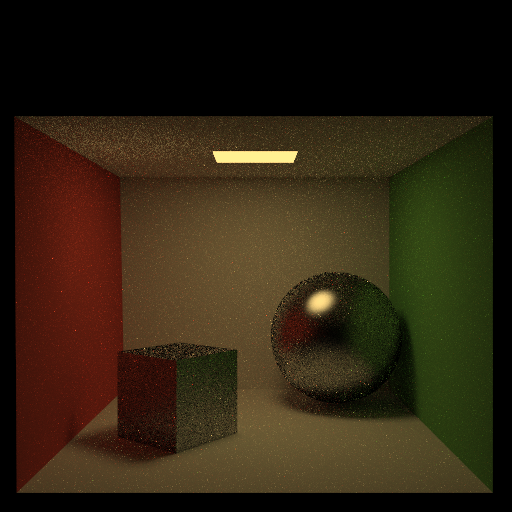
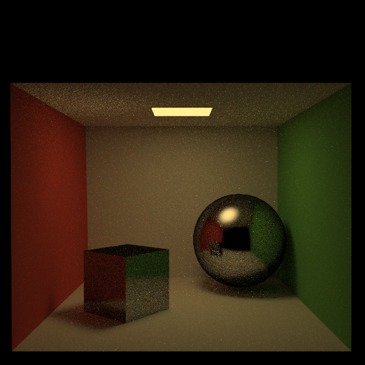
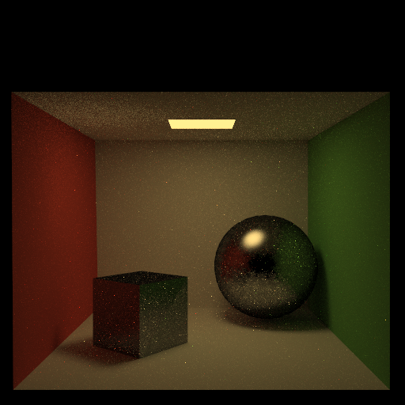
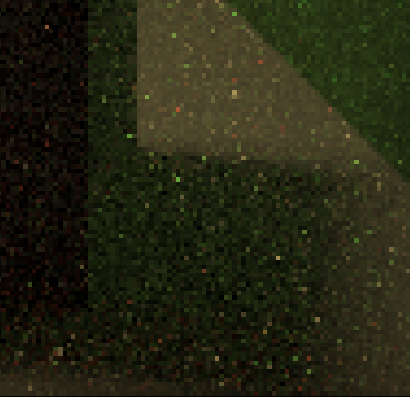

## Path-Tracer-Photorealistic-Rendering

This project implements a physically-based renderer using Monte Carlo sampling of path tracing, which supports 6 BRDFs, soft shadows, indirect illumination, Russian roulette path termination, SDR/HDR tone mapping, attenuate refraction, stratified sampling, depth of field, low discrepancy sampling, BRDF importance sampling, etc. This project associates with Brown CSCI 2240 Computer Graphics course and the assignment requirement can be found in ```assignment.md```.

### 4 Basic BRDFs with Soft Shadows, Indirect Illumination, Russian Roulette Path Termination, SDR/HDR Tone Mapping
Run the program with the specified `.ini` config file to compare your output against the reference images. The program should automatically save to the correct path for the images to appear in the table below.
<!-- 
If you are not using the Qt framework, you may also produce your outputs otherwise so long as you place them in the correct directories as specified in the table. In this case, please also describe how your code can be run to reproduce your outputs -->

> Qt Creator users: If your program can't find certain files or you aren't seeing your output images appear, make sure to:<br/>
> 1. Set your working directory to the project directory
> 2. Set the command-line argument in Qt Creator to `template_inis/final/<ini_file_name>.ini`

<!-- Note that your outputs do **not** need to exactly match the reference outputs. There are several factors that may result in minor differences, such as your choice of tone mapping and randomness. -->


<!-- Please do not attempt to duplicate the given reference images; we have tools to detect this. -->

| `.ini` File To Produce Output | Expected Output | Your Output |
| :---------------------------------------: | :--------------------------------------------------: | :-------------------------------------------------: |
| cornell_box_full_lighting.ini |   |  |
| cornell_box_direct_lighting_only.ini |   |  |
| cornell_box_full_lighting_low_probability.ini |   |  |
| mirror.ini |   |  |
| glossy.ini |   |  |
| refraction.ini |   |  |

> Note: The reference images above were produced using the [Extended Reinhard](https://64.github.io/tonemapping/#extended-reinhard) tone mapping function with minor gamma correction. You may choose to use another mapping function or omit gamma correction.

### Design Choices
Please list all the features your path tracer implements.
Required features:
- **Four basic types of BRDFs**: All 4 required BRDFs are supported. The total diffusion BRDF is activated when specular terms are very small. The glossy reflective BRDF is activated when specular terms are moderately large while the shininess is not too large. The mirror reflection BRDF is activated when shininess is larger than 500. The refraction BRDF (with Fresnel) is activated when objects are not opaque and have a reasonably obvious refraction factor.
- **Soft shadows**: The soft shadows are implemented by randomly sampling on the the light sources. Especially in direct lighting, when shooting rays from the hit point to light sources, the ray direction is determined by randomly sampling on emissive triangles (related functions in ```utils/helper.cpp/samplePointsInTriangle``` and ```utils/helper.cpp/triangleArea```)
- **Indirect illumination**: The indirect illumination is implemented by recursively sending random rays along paths and add up the radiance along the path. Color bleeding and caustics can be seen in all images which are not direct light only.
- **Russian roulette path termination**: Russian roulette path termination is implemented in the recursive indirect path tracing. It terminates the recursive tracing with an upper bound probability and then divide such probability when accumulating the radiance to provide unbiased images.
- **Event splitting**: At each recursive path tracing step, both direct lighting and indirect lighting are combined. To avoid doubling counting, a boolean ```countEmitted``` is used to control the accumulation of emission term, which is only set to true when the material is ideal reflection/refraction or in the top level recursion step.
- **Tone mapping**: Tone mapping is used to map a high-dynamic range image to standard dynamic range image. Both Reinhard and extended Reinhard mappings are implemented, and the gamma correction is carried out on the illuminance value to reduce color shifting in tone mapping (see ```utils/helper.cpp/toneMap```). Note that my code also automatically save a .pfm HDR image for each input for visualization.


### Extra Features 
Briefly explain your implementation of any extra features, provide output images, and describe what each image demonstrates.

#### 1. Attenuate refracted paths
For refracted lights, attenuation is implemented by darkening lights that travel long distances inside an object. The attenuation value with regard to distance is calculated by ```1.0 / (1 + 1.0*distance + 1.0*distance*distance)``` (see ```utils/helper.cpp/calRefractAttenuation```). 

The ```enableAttenuateRefraction``` flag in the .ini file and settings is used to enable or disable this effect.
| No attenuation | Attenuated refraction |
| :--------------------------------------------------: | :-------------------------------------------------: |
| refraction.ini | refraction_attenuation.ini |
|   |  |

#### 2. Depth of Field
Depth of field is implemented by pushing the image plane (where ray focus) further into the scene by focal length, and sample ray sources (i.e., camera position) from a circle which radius is determined by apeture. Corresponding functions can be found in ```utils/helper.cpp/calLensPoint``` and ```utils/helper.cpp/calDirection```. The image shown below has the setting of ```aperture = 0.1f``` and ```focalLength = 6.0f```, where the nearer ball is less in focus and the farther ball is more in focus. This scene may not be the best scene to show a very clear effect due to its limited depth but the difference of focus is visible.

The ```enableDepthOfField``` flag in the .ini file and settings is used to enable or disable this effect.
| No depth of field | With depth of field |
| :--------------------------------------------------: | :-------------------------------------------------: |
| refraction.ini | refraction_dof.ini |
|   |  |

#### 3. BRDF importance sampling
I implememented 2 BRDF importance sampling to sample rays with probability that are proportional to the high rediance contribution directions. BRDF importance sampling could reduce the noise when compared to uniform sampling in the same sampling rate.

The ```enableImportanceSampling``` flag in the .ini file and settings is used to enable or disable this effect.

##### a. Diffuse BRDF
Importance sampling for diffuse BRDF is implemented by sampling on the hemisphere with a probability that is proportional to the cosine of the angle between the normal and incoming light. The implementation can be found in ```utils/helper.cpp/cosineWeightedSampleHemisphere```. The comparison shown below use the eact same settings for sampling number for each pixel (50) and continuous probalities (50%). The shadow areas in the importance sampled images are cleaner than the uniform sampled one.
|  | No importance sampling | With importance sampling |
| :---------------------------------------: | :--------------------------------------------------: | :-------------------------------------------------: |
| .ini file name | cornell_box_full_lighting_mid_probability.ini | cornell_box_full_lighting_mid_probability_importance_sampling.ini |
| Full size |   |  |
| Zoom in 1 |   |  |
| Zoom in 2 |   |  |

##### b. Glossy specular BRDF
Importance sampling for glossy specular BRDF is implemented by sampling on the hemisphere with a probability that is proportional to the n th power of the cosine of the angle between the looking direction and the reflected incoming light. The implementation can be found in ```utils/helper.cpp/glossySpecularSampleHemisphere```. The comparison shown below use the eact same settings for sampling number for each pixel (100) and continuous probalities (90%). The shadow areas in the importance sampled images are much cleaner than the uniform sampled one.
|  | No importance sampling | With importance sampling |
| :---------------------------------------: | :--------------------------------------------------: | :-------------------------------------------------: |
| .ini file name | glossy.ini | glossy_importance_sampling.ini |
| Full size |   |  |
| Zoom in 1 |   |  |
| Zoom in 2 |   |  |

#### 4. More advanced BRDF
##### a. Cook-Torrance Specular BRDF
Cook-Torrance specular BRDF is implemented to enable control of the roughness of glossy specular BRDFs. The implementation can be found in ```utils/brdf.cpp/cookTorranceSpecularBRDF```. This function uses several helpers to calculate different components of the calculation, including ```beckmannDistribution```, ```geometricAttenuation```, and ```fresnelConductor```. The comparisons below show the difference of roughness when changing the alpha parameters, where the smooth one looks similar to ideal reflection and the rough one looks similar to diffusion.

The ```enableCookTorranceBRDF``` flag in the .ini file and settings is used to enable or disable this effect.
| Smooth | Glossy | Rough |
| :---------------------------------------: | :--------------------------------------------------: | :-------------------------------------------------: |
| alpha=1/shininess | alpha=1/sqrt(shininess) | alpha=0.4 |
|  |   |  |

##### b. Ward anisotropic BRDF
Ward anisotropic specular BRDF is implemented to enable control of the roughness of glossy specular BRDFs and the anisotropic specular in different directions. The implementation can be found in ```utils/brdf.cpp/wardAnisotropicSpecular```. A helper function ```calculateTangentBitangent``` is used to calculate the anisotropic directions. The first row of comparison shows the difference of roughness when changing the alphaX and aplphaY parameters. The second row of comparison shows the difference of roughness when using drastically different alphaX and aplphaY.

The ```enableWardAnisotropicBRDF``` flag in the .ini file and settings is used to enable or disable this effect.
| Smooth | Glossy | Rough |
| :---------------------------------------: | :--------------------------------------------------: | :-------------------------------------------------: |
| alphaX=alphaY=1/shininess | alphaX=alphaY=1/sqrt(shininess) | alphaX=alphaY=0.4 |
|  |   |  |

| Anistropic | Same | Anistropic |
| :---------------------------------------: | :--------------------------------------------------: | :-------------------------------------------------: |
| alphaX=1/shininess, alphaY=0.4 | alphaX=alphaY=1/shininess | alphaX=0.4, alphaY=1/shininess |
|  |   |  |

#### 5. Stratified sampling
Stratified sampling is implemented by decomposing each pixel into grids and then randomly sample in each grid to reduce discrepancy. The compation below shows only very slight improvements in the cleaniness of the shadows areas. I found it pretty hard to set of parameters for a clearer difference. The current sample per pixel is 25 and continue probability is 0.5.

The ```enableStratifiedSampling``` flag in the .ini file and settings is used to enable or disable this effect.
|  | No stratified sampling | Stratified sampling |
| :---------------------------------------: | :--------------------------------------------------: | :-------------------------------------------------: |
| .ini file name | cornell_box_low_sample_no_stratified.ini | cornell_box_low_sample_stratified.ini |
| Full size |   |  |
| Shadow area 1 |   |  |
| Shadow area 2 |   |  |

#### 6. Low discrepancy sampling
Low discrepancy sampling is implemented by Halton Sequence which generates pseudo-random sampling to enable quasi-Monte-Carlo integration. The sampling settings are the same as the results shown in stratified sampling. The he compation below shows slightly cleaner shadow areas and much cleaner light areas than the the random sampling.

The ```enableLowDiscrepancySampling``` flag in the .ini file and settings is used to enable or disable this effect.
|  | Random sampling | Low discrepancy sampling |
| :---------------------------------------: | :--------------------------------------------------: | :-------------------------------------------------: |
| .ini file name | cornell_box_low_sample_low_discrepancy.ini | cornell_box_low_sample_low_discrepancy.ini |
| Full size |   |  |
| Zoom in 1 |   |  |
| Zoom in 2 |   |  |

### Collaboration/References
I clarify that there is no collaboration include when I do this project.

References for mathematical formulas only (no code are referenced):
- Cook-Torrance Specular BRDF: https://en.wikipedia.org/wiki/Specular_highlight#Cook.E2.80.93Torrance_model
- Ward anisotropic BRDF: https://en.wikipedia.org/wiki/Specular_highlight#Ward_anisotropic_distribution
- Low discrepancy sampling: https://www.scratchapixel.com/lessons/mathematics-physics-for-computer-graphics/monte-carlo-methods-in-practice/introduction-quasi-monte-carlo

### Known Bugs

The main bug is the visualization of comparisons between random sampling, stratified sampling, and low discrepancy sampling. There are some slight differences but it's not very obvious. I have checked that my implementation should be correct. It's tricky to set up a scene and rendering parementeres which could show clear differences.
